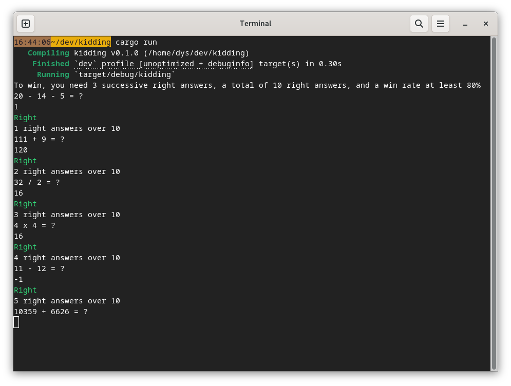

A very simple program asking questions like `35 + 12 = ?` in a loop until a predefined goal is reached.

The code is easy to tune and change with the kid, it's a basis for a coding play too.



# Prerequesite

* some basic programming and terminal know-how
* git
* rust: https://rustup.rs/

# Install

Clone this repository, go inside:

```
git clone https://github.com/Canop/kidding
cd kidding
```

# Modify

Open the `src/main.rs` file, try to see where the questions are defined, modify those parts.

You can add or remove question kinds, and change the number ranges for each kind.

I tried to make it obvious and easy to change but don't hesitate to come to my chat if you have any question: https://miaou.dystroy.org/3

Questions are now either in French or in English, but you may add yours.

# Launch

Just run `cargo run` : the program will be recompiled and executed.
